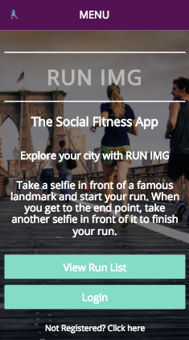

# RUN IMG

### Aim of the project

The aim of the project was to create a mobile based social fitness app that would use google's landmark recognition API to locate start and end points of a run from user uploaded photos.

The deployed app can be found [here](https://arcane-cove-82778.herokuapp.com/).

### Planning

To plan the project, we initially drew out what pages would be needed and the routes users would take to get to them.

We spent a whole day planning our page mock ups on MyBalsamiq as well as our to-do lists in Trello.  That would give a a reference to how the app should look as well as the user journey.

### Coding

The app was built using a MEAN stack and integrated Google Maps and Google Vision api's.

Languages used:
* Node
* Express
* Angular
* Mongo
* SCSS
* HTML5

### What went well

##### Planning

After realising our first idea didn't cover all the CRUD bases, we came up with this idea relatively quickly.

Creating a balsamiq mock up went well and we were quickly able to visualise how the app was intended to work and look.

###### Coding

We worked well together working out what needed to be done and who would be best suited for the job.

### What was a challenge

##### Planning

We stumbled across a few planning problems during the coding process.

We had intended on creating a few more extra features but as the app unfolded and we realised we would hit the MVP later than expected, we didn't have a concrete idea of what exact routes we needed. We had to go back to the drawing board almost daily to re-configure our plans.

#### Coding

Due to varying skill levels in the group, it was difficult for everyone to contribute to certain parts of the project.

### If we had more time we'd like to...

* Create user profiles with image upload
* Allow users to add tracks
* OR allow users to pick any start and endpoint from any landmark, create new track if there are no sprints for it
* Have routes for different cities / countries
* Rate/review tracks
* Have a leaderboard for each track
* Show markers for (? nearby : all) landmarks
* OR show all routes color-coded on map
* Geolocation API if Google Vision doesn't pick up location
* Filter tracks by distance
* Add directions panel to map
* Post sprints to social media
